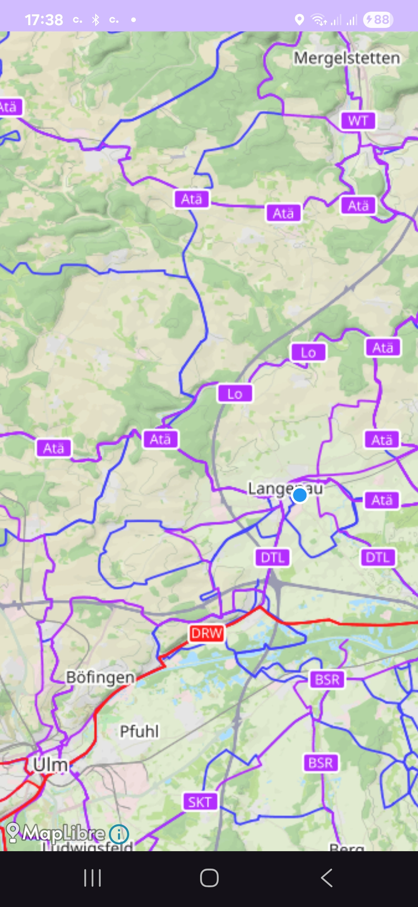

# CycleMate

Android app for loading OCM and adding a "You-are-here-button".

<a href="images/Screenshot.jpg">
  
</a>

## SetUp
Add gradle.properties:

```
# AndroidX aktivieren
android.useAndroidX=true
android.enableJetifier=true
org.gradle.jvmargs=-Xmx2048m -Dfile.encoding=UTF-8

THUNDERFOREST_KEY=<add your key here>
```
### Thunderforest Key
Obtain a Thunderforest API key by creating an account and retrieving the key from your dashboard - for a detailed documentation check `https://www.thunderforest.com/docs/apikeys/`.
